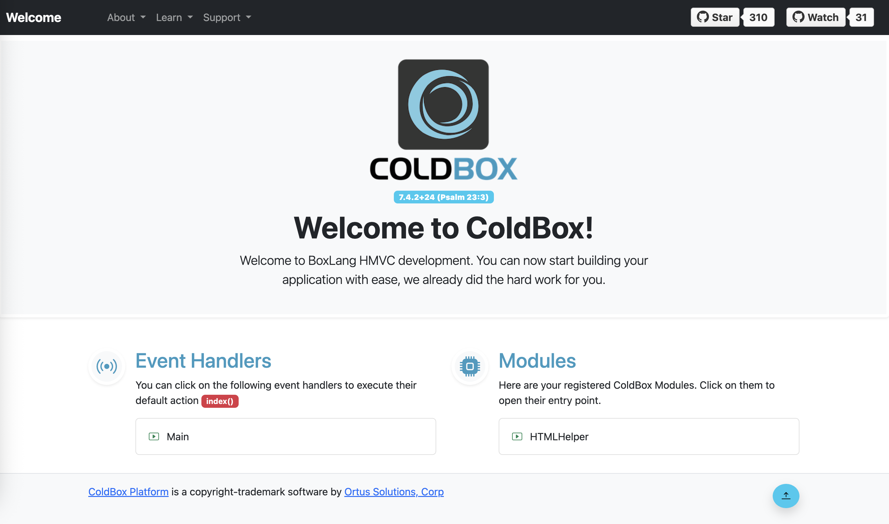

# Deploy a BoxLang application on Clever Cloud
[](https://clever-cloud.com)

This is an example of how to deploy a [BoxLang](https://www.boxlang.io/) application on Clever Cloud.

This example uses the [`linux` runtime](https://www.clever-cloud.com/developers/doc/applications/linux/) on Clever Cloud. The `clever-cloud.sh` script handles the setup of the [CommandBox](https://www.commandbox.io/) server.

## Deployment steps

To deploy this application, you need [Clever Tools](https://github.com/CleverCloud/clever-tools), the Clever Cloud CLI.

```bash
# Step 1. Create the application
clever create --type linux boxlang-example

# Step 2: Add your domain (optional but recommended)
clever domain add <YOUR_DOMAIN_NAME>

# Step 3: Set the run command
clever deploy
```

And you're done! Your application is deploying and will be available on the `<YOUR_DOMAIN_NAME>` domain.



## Troubleshooting

If you encounter issues:

1. Check the application logs: `clever logs`
2. Verify all environment variables are correctly set: `clever env`
3. Ensure the add-ons are properly linked: `clever service status`

## Contributing

Contributions to improve this deployment example are welcome! Please feel free to submit pull requests or open issues for any enhancements or bug fixes.

## License

This example is provided under the terms of the MIT license.
